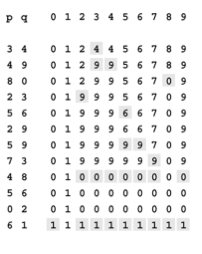
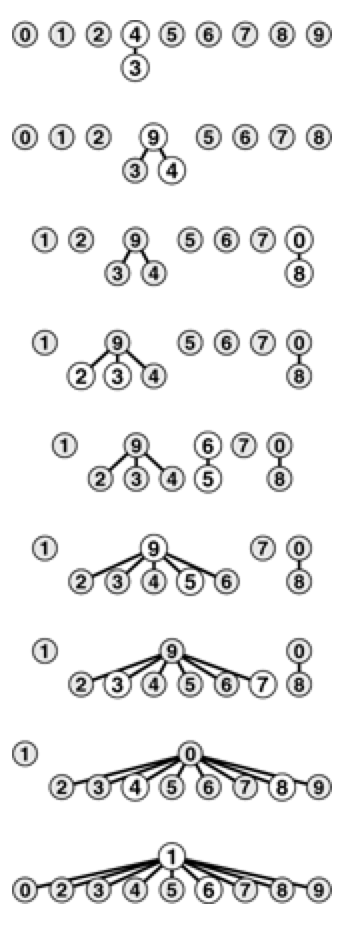

# Union-find Algorithms

A simple method for counting the number of sets remaining after using the union and find operations to solve the connectivity problem as described in the text.

`quick_find.cpp` : An implementation of a simple algorithm called the quick-find algorithm that solves the connectivity problem

`quick_union.cpp` : An implementation of a simple algorithm called the quick-union algorithm that solves the connectivity problem